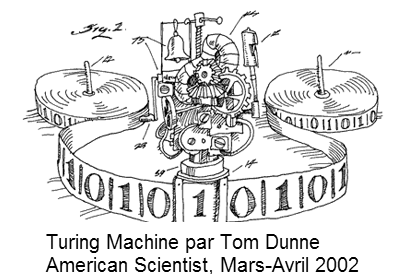

TM: Turing Machine implement in Golang
==============

[](https://raw.githubusercontent.com/kkdai/tm/master/LICENSE)  [](https://godoc.org/github.com/kkdai/tm)  [](https://travis-ci.org/kkdai/tm)



What is this Turing Machine
=============

A Turing machine is an abstract "machine" that manipulates symbols on a strip of tape according to a table of rules; to be more exact, it is a mathematical model that defines such a device. Despite the model's simplicity, given any computer algorithm, a Turing machine can be constructed that is capable of simulating that algorithm's logic. (cited from [wiki](https://en.wikipedia.org/wiki/Turing_machine))


 

Installation and Usage
=============


Install
---------------

    go get github.com/kkdai/tm


Usage
---------------

Following is sample code to implement a TM to rewrite all tape 0 to 1 as follow:


```go

package main

import (
    "fmt"
    . "github.com/kkdai/tm"
)

func main() {
	nTM := NewTM()
	
	//Input State and declare if it is final state
	nTM.InputState("0", false)
	nTM.InputState("1", true)

	//Input config
	// InputConfig parameter as follow:
	//	- SourceState, 
	// - Input
	// - Modified Value
	// - DestinationState 
	// - Tape Head Move Direction
	nTM.InputConfig("0", "1", "1", "1", MoveRight)
	nTM.InputConfig("0", "0", "1", "0", MoveLeft)
	nTM.InputConfig("1", "0", "1", "0", MoveLeft)
	nTM.InputConfig("1", "1", "1", "1", MoveRight)

	//Input tape data
	nTM.InputTape("0", "0", "1", "1", "0", "0", "0")

	//Run TM to the finish (if exist)
	nTM.Run()
	
	fmt.Println("New Tape:=", nTM.ExportTape())
	}

```

Inspired By
=============

- [Coursera: Automata](https://class.coursera.org/automata-004/)
- [https://www.cl.cam.ac.uk/projects/raspberrypi/tutorials/turing-machine/four.html](https://www.cl.cam.ac.uk/projects/raspberrypi/tutorials/turing-machine/four.html)
- [Wiki: 圖靈機](https://zh.wikipedia.org/wiki/%E5%9B%BE%E7%81%B5%E6%9C%BA)
- [https://en.wikipedia.org/wiki/Turing_machine_examples](https://en.wikipedia.org/wiki/Turing_machine_examples)


Project52
---------------

It is one of my [project 52](https://github.com/kkdai/project52).


License
---------------

This package is licensed under MIT license. See LICENSE for details.
